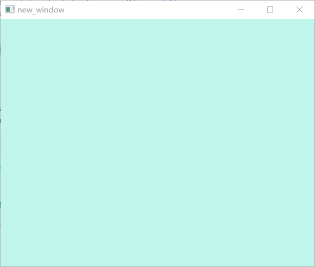

# 1.1.10 高端清屏

我们既然已经获得了鼠标的位置,
那么我们可以尝试利用鼠标的位置去给屏幕换上不同的颜色

```rust
// 根据鼠标的位置将屏幕染成指定的颜色
pub fn clear_color_by_mouse(
    s: &mut HardwareState,
    color: [f32; 4],
) -> Result<Option<gfx_hal::window::Suboptimal>, &'static str> {
    // 设置信号量
    let image_available = &s.image_available_semaphores[s.current_frame];
    let render_finished = &s.render_finished_semaphores[s.current_frame];
    // 获取当前帧数
    s.current_frame = (s.current_frame + 1) % s.frames_in_flight;

    let (i_u32, i_usize) = unsafe {
        let (image_index, _) = s
            .swapchain
            //请求从swapchain里取出一个图片
            .acquire_image(
                core::u64::MAX,
                Some(image_available),
                Some(&s.in_flight_fences[s.current_frame]),
            )
            .map_err(|_| "错误,不能从交换链中取出图片!")?;
        (image_index, image_index as usize)
    };

    let flight_fence = &s.in_flight_fences[i_usize];
    unsafe {
        s.device
            .wait_for_fence(flight_fence, core::u64::MAX)
            .map_err(|_| "错误,等待内存屏障失败!")?;
        s.device
            .reset_fence(flight_fence)
            .map_err(|_| "错误,重置内存屏障失败!")?;
    }

    unsafe {
        // 获取一个command buffer
        let buffer = &mut s.command_buffers[i_usize];
        // 拿到Clear color 的值
        let clear_values = [ClearValue::Color(ClearColor::from(color))];
        buffer.begin(false);
        buffer.begin_render_pass_inline(
            &s.render_pass,
            &s.framebuffers[i_usize],
            s.render_area,
            clear_values.iter(),
        );
        buffer.finish();
    }

    // 拿到command buffer
    let command_buffers = &s.command_buffers[i_usize..=i_usize];
    // 等信号量各就各位
    let wait_semaphores: ArrayVec<[_; 1]> =
        [(image_available, PipelineStage::COLOR_ATTACHMENT_OUTPUT)].into();
    let signal_semaphores: ArrayVec<[_; 1]> = [render_finished].into();
    let present_wait_semaphores: ArrayVec<[_; 1]> = [render_finished].into();
    // 开推
    let submission = Submission {
        command_buffers,
        wait_semaphores,
        signal_semaphores,
    };

    // 扔到控制队列
    let the_command_queue = &mut s.queue_group.queues[0];
    // tada! 完成了 
    unsafe {
        the_command_queue.submit(submission, Some(flight_fence));
        s.swapchain
            .present(the_command_queue, i_u32, present_wait_semaphores)
            .map_err(|_| "错误,添加到区块链失败!")
    }
}

```
然后我们在`app.rs`中去写一个根据鼠标位置变换rgb的函数
```rust
fn change_rgb_by_state(hal_state: &mut HardwareState, local_state: &LocalState) {
    let b = (local_state.mouse_x / local_state.frame_width) as f32;
    let g = (local_state.mouse_y / local_state.frame_height) as f32;
    let r = (b + g) * 0.3;
    let a = 1.0;
    let _ = clear_color_by_mouse(hal_state, [r, g, b, a]);
}
```
最后我们再重写下`App`
```rust
impl App {
    pub fn new() {
        let mut ws = WindowState::new(title, (1024f64, 768f64));
        let mut hs = match HardwareState::new(&ws.window, title) {
            Ok(x) => x,
            Err(x) => panic!(),
        };
        let (frame_width, frame_height) = ws
            .window
            .get_inner_size()
            .map(|logical| logical.into())
            .unwrap_or((1.0, 1.0));
        let mut ls = LocalState {
            frame_width,
            frame_height,
            mouse_x: 0.0,
            mouse_y: 0.0,
        };
        let mut running = true;
        while running {
            let inputs = UserInput::poll_events_loop(&mut ws.evloop);
            if inputs.end_requested {
                running = false;
            }
            if inputs.new_frame_size.is_some() {
                drop(hs);
                hs = match HardwareState::new(&ws.window, title) {
                    Ok(state) => state,
                    Err(e) => panic!(e),
                };
            }
            ls.update_from_input(inputs);
            change_rgb_by_state(&mut hs, &ls);
        }
    }
}

```
现在我们去运行一下,会发现屏幕的颜色跟随鼠标的位置而改变
