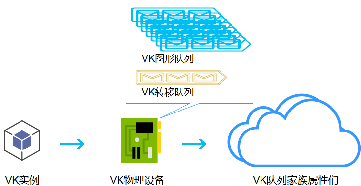

# 物理设备和逻辑设备的创建

```rust
#[cfg(feature = "dx12")]
use gfx_backend_dx12 as back;
#[cfg(feature = "vulkan")]
use gfx_backend_vulkan as back;
#[cfg(feature = "metal")]
use gfx_backend_metal as back;
#[cfg(not(any(feature = "vulkan", feature = "dx12",feature = "metal",)))]
use gfx_backend_vulkan as back;
```
这是我们已经有了的东西
选中了```vulkan```作为我们的后端,不过你要是喜欢```dx12```也可以

```rust
// 创建一个实例
let instance = back::Instance::create(title, 1);
// 创建一个Surface(应该用绑定更好)
let mut surface = instance.create_surface(window);
// 使用一个adapter(转接器)
let adapter = instance
    .enumerate_adapters()
    .into_iter()
    .find(|a| {
        a.queue_families
            .iter()
            .any(|qf| qf.supports_graphics() && surface.supports_queue_family(qf))
    })
    .ok_or("找不到任何可用的转接器")?;
```

`surface`指的就是你的屏幕
`adapter`是我在`gfx-hal`看到的一个概念,用来抽象逻辑设备和队列簇的
有一个图可以帮助理解,虽然是我做`vulkan`教程用剩下的但是能够帮助理解实例,设备和队列簇的关系的


```rust
// 使用一个设备和一个队列簇
let (device, queue_group) = adapter
    .open_with::<_, Graphics>(1, |family| surface.supports_queue_family(family))
    .unwrap();
```
这几行也很简单,首先使用adapter搜索有支持Graphics的显卡,如果这个显卡支持队列簇(是个民用显卡都会支持的)就返回这个显卡

`devide`是一个逻辑设备,这里物理设备到逻辑设备的转换已经由`gfx-hal`写好了,我们不必操心这部分了(之前需要写一堆配置文件)
然后`queue group`就是我们的队列簇了